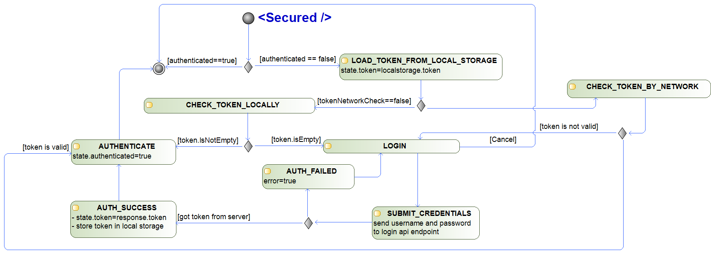
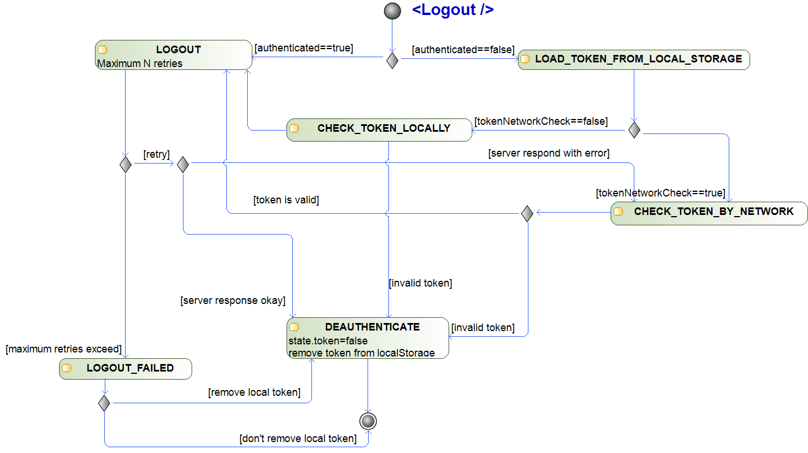

# Authentication module with redux and Material-UI default login forms

91 downloads in one day. wow :)

uploaded it here to make it easier to distribute

# Supported authentication providers

Spring Boot
- /api/authenticate endpoint
- jwt authentication. response from server is parsed for id_token key in the root of json

# Supported boilerplate

This module is writed for https://github.com/react-boilerplate/react-boilerplate boilerplate

But nothing stops to use it in any another boilerplate. Just keep in mind that, if your application uses Redux to manage the state, then you need to inject Secured Redux Store into Your Redux Store. react-boilerplate have function for this in utils/injectReducer and utils/injectSaga.

# How to use

import Secured from 'secured';

or
Secured = require('secured);

or whatever you like to import javascript module

Wrap your secured content in **\<Secured>...\</Secured>** tag and hope that it works :D

Authentication goes to http://localhost:8080/. This is default Spring Boot application development port.

# TODO

- add **authentication_url** parameter
- add api for reducer and saga injectors
- detect if already wrapped in MuiProvider (Material-UI specific support feature)
- parametrized way to deal by default. 1) redirect to login page; 2) login form in popup dialog; 3) login form right inside \<Secured> block
- real examples
- publish on github :D
- documentation about how to override default actions
- documentation about how to use use built in LoginForm/LoginPage on your own route path. How to override final actions and so
- update diagrams to explaining asynchrony in processes inside the module
- add support for different authentication providers
- add support for authirization (different authorizatoin providers?)

# Activity diagrams

helps me to understands declarative code

## \<Secured />

## \<Logout />

